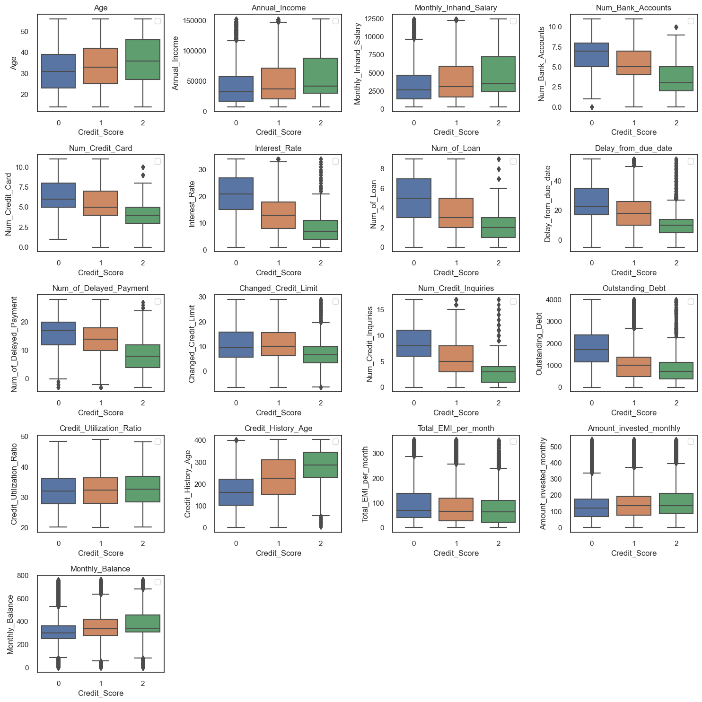
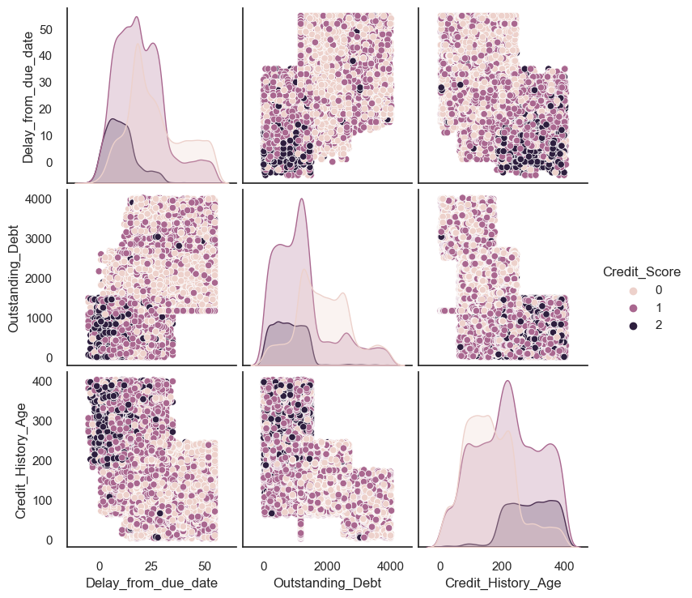
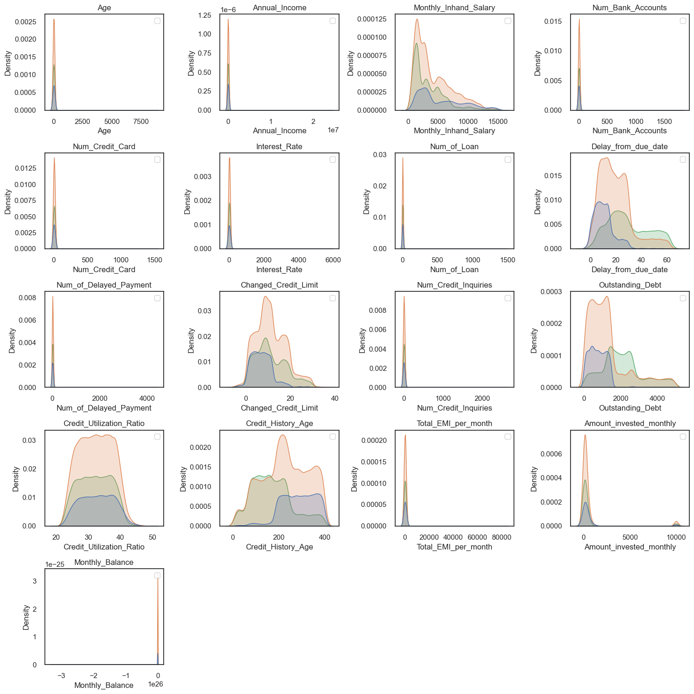
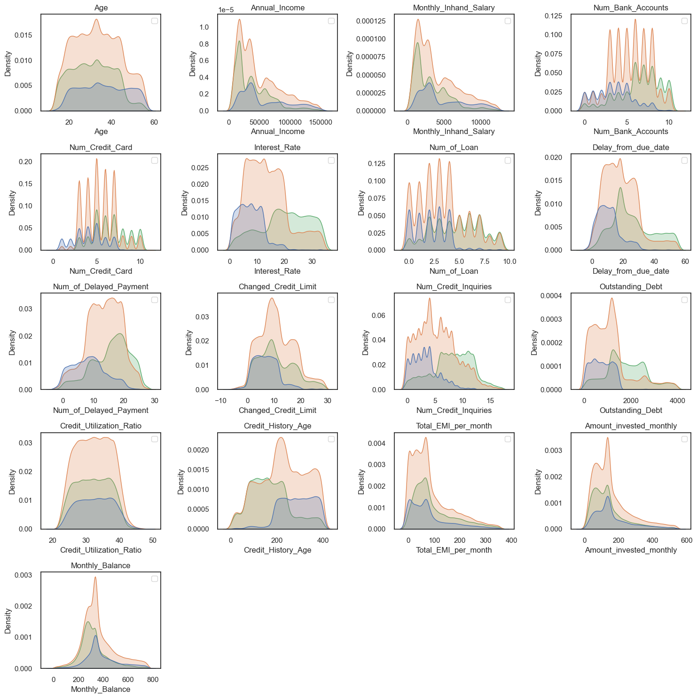
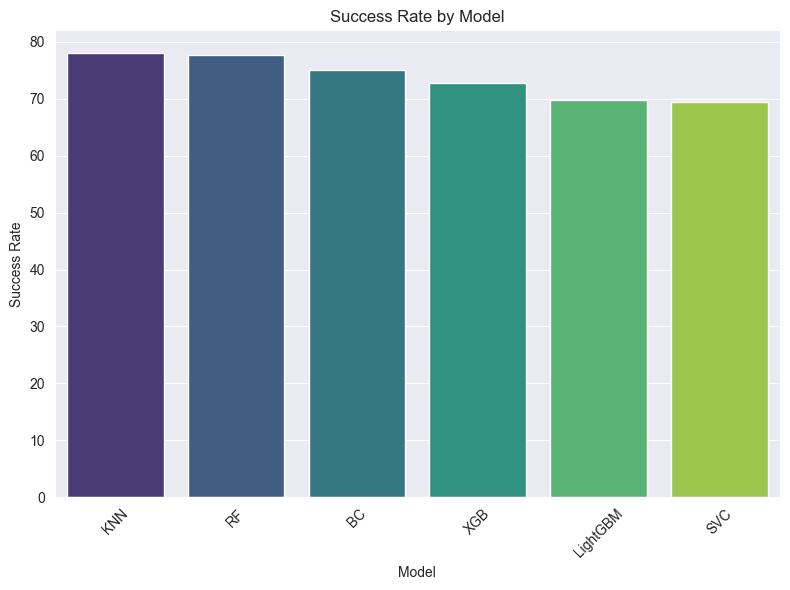

## Table of Contents

- [Table of Contents](#table-of-contents)
- [Introduction](#introduction)
- [Data Cleaning and handling Missing values](#data-cleaning-and-handling-missing-values)
- [EDA](#eda)
  - [BoxPlot of Numeric Columns](#boxplot-of-numeric-columns)
  - [PairPlot of Payment\_Behavior against other important features](#pairplot-of-payment_behavior-against-other-important-features)
- [Outlier Detection and Removal](#outlier-detection-and-removal)
- [How I dealt with un-balanced Distribution](#how-i-dealt-with-un-balanced-distribution)
- [Model Selection](#model-selection)
- [Results](#results)

## Introduction

- Developed a Credit Score Classifier with 79.24% accuracy using various Machine Learning Models such as : 
- Employed various Classification models such as KNN, Random Forests, XGBoost, LightGBM, SVC, etc.
- Did Hyperparameter tuning on the KNN model to achieve even better results
- Employed Ensemble Modeling to improve the predictive performance of the individual models.

## Data Cleaning and handling Missing values

| Feature                 | Count   | Unique | Top                             | Freq  |
|-------------------------|---------|--------|---------------------------------|-------|
| Customer_ID             | 100,000 | 12,500 | CUS_0xd40                       | 8     |
| Month                   | 100,000 | 8      | January                         | 12,500|
| Age                     | 100,000 | 1,788  | 38                              | 2,833 |
| Occupation              | 100,000 | 16     | _______                         | 7,062 |
| Annual_Income           | 100,000 | 18,940 | 36,585.12                       | 16    |
| Num_of_Loan             | 100,000 | 434    | 3                               | 14,386|
| Type_of_Loan            | 88,592  | 6,260  | Not Specified                   | 1,408 |
| Num_of_Delayed_Payment  | 92,998  | 749    | 19                              | 5,327 |
| Changed_Credit_Limit    | 100,000 | 4,384  | _                               | 2,091 |
| Credit_Mix              | 100,000 | 4      | Standard                        | 36,479|
| Outstanding_Debt        | 100,000 | 13,178 | 1,360.45                        | 24    |
| Credit_History_Age      | 90,970  | 404    | 15 Years and 11 Months          | 446   |
| Payment_of_Min_Amount   | 100,000 | 3      | Yes                             | 52,326|
| Amount_invested_monthly | 95,521  | 91,049 | __10,000__                      | 4,305 |
| Payment_Behaviour       | 100,000 | 7      | Low_spent_Small_value_payments | 25,513|
| Monthly_Balance         | 98,800  | 98,792 | __-333333333333333333333333333__| 9     |
| Credit_Score            | 100,000 | 3      | Standard                        | 5,317 |

- As can be seen from the above table, there were too many inconsistencies and errors in the dataset which had to be cleaned
- To tackle data cleaning, I created custom functions to efficiently clean both the numerical and categorical columns.

## EDA
The insights gleaned from the pivot tables highlight key findings from this comprehensive analysis.
### BoxPlot of Numeric Columns


### PairPlot of Payment_Behavior against other important features


## Outlier Detection and Removal
| Before | After |
|--------|-------|
|  |  |

## How I dealt with un-balanced Distribution
- The data set showed unbalance distribution. This may cause a biased estimate.
- So we will use SMOTE, an oversampling process that allows synthetic data to be generated.
```python
sm = SMOTE(random_state=2)
smote_train_X, smote_train_Y = sm.fit_resample(X_train, y_train)
```
## Model Selection
After training various models on the Dataset, I came to the following conclusion:
  
| Model    | Success |
|----------|---------|
| KNN      | 78.105  |
| RF       | 77.650  |
| BC       | 75.010  |
| XGB      | 72.745  |
| LightGBM | 69.750  |
| SVC      | 69.435  |



## Results
|           | Precision | Recall | F1-Score | Support |
|-----------|-----------|--------|----------|---------|
| 0         | 0.77      | 0.86   | 0.81     | 5,874   |
| 1         | 0.85      | 0.75   | 0.80     | 10,599  |
| 2         | 0.69      | 0.82   | 0.75     | 3,527   |
| Accuracy  |           |        | 0.79     | 20,000  |
| Macro Avg | 0.77      | 0.81   | 0.79     | 20,000  |
| Weighted Avg | 0.80   | 0.79   | 0.79     | 20,000  |

